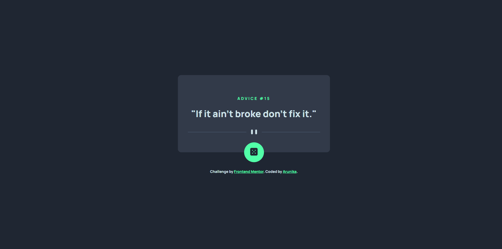
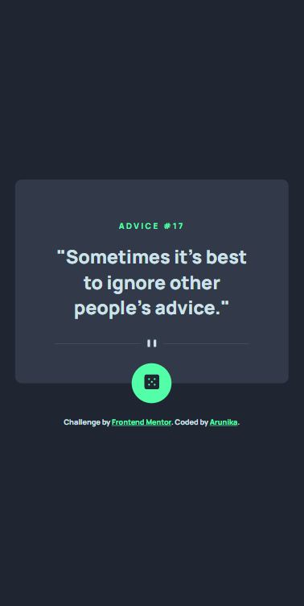

# Frontend Mentor - Advice generator app solution

This is a solution to the [Advice generator app challenge on Frontend Mentor](https://www.frontendmentor.io/challenges/advice-generator-app-QdUG-13db). Frontend Mentor challenges help you improve your coding skills by building realistic projects.

## Table of contents

- [Overview](#overview)
  - [The challenge](#the-challenge)
  - [Screenshot](#screenshot)
  - [Links](#links)
- [My process](#my-process)
  - [Built with](#built-with)
  - [What I learned](#what-i-learned)
- [Author](#author)

## Overview

### The challenge

Users should be able to:

- View the optimal layout for the app depending on their device's screen size
- See hover states for all interactive elements on the page
- Generate a new piece of advice by clicking the dice icon

### Screenshot
 


### Links

- Solution URL: [Github](https://github.com/shidqiiii/Advice-generator-app)
- Live Site URL: [Netify](https://advice-generator-dev-arunika.netlify.app/)

## My process

### Built with

- Semantic HTML5 markup
- CSS custom properties
- Flexbox
- Rest API

**Note: These are just examples. Delete this note and replace the list above with your own choices**

### What I learned

Learn to fetch api and display data

To see how you can add code snippets, see below:

```js
let getAdvice = function () {
  fetch(url)
    .then((response) => response.json())
    .then((data) => {
      console.log(data.slip);

      id.innerHTML = data.slip.id;
      text.innerHTML = data.slip.advice;
    });
};
```

## Author

- Website - [Arunika](https://arunikaproject.netlify.app/)
- Frontend Mentor - [@shidqiiii](https://www.frontendmentor.io/profile/shidqiiii)
